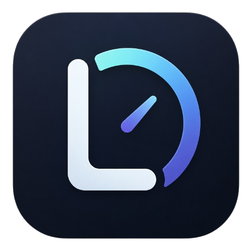

<div align="center">
  
  <h1>Lumen</h1>
  <p>
    <strong>Cross-platform screen-time tracker</strong>
  </p>
  <p>
    
    
    
    
    
  </p>
  <br />
</div>

**Lumen** tracks which applications you use and shows your usage statistics in a compact overlay. No cloud, no telemetry — everything is stored locally in SQLite.

<br />

## Features

| | |
|---|---|
| ⚡ **Real-time** | Instant app switching via native OS events (WinEvent / NSWorkspace / x11) |
| 🎮 **Fullscreen Detector** | Games and fullscreen apps won't skew your stats |
| 💤 **Idle Detection** | Automatically pauses tracking when you're away |
| 📊 **Daily Statistics** | Donut chart + detailed list with proportional bars |
| 🎨 **Custom Rendering** | `winit` + `tiny-skia` + `softbuffer` — no Electron |
| 🧹 **Minimal** | Chromeless window with custom titlebar; minimizes to tray |
| 💾 **Local Storage** | SQLite — your data stays yours |
| 🔄 **Autostart** | Launches at login (LaunchAgent / XDG / Registry) |

<br />

## Installation

### macOS

> ⚠️ **Gatekeeper**: Lumen is not signed with a Developer ID ($99/year). On first launch run:

```bash
# Remove the quarantine attribute
xattr -dr com.apple.quarantine /Applications/Lumen.app

# Or: right-click Lumen.app → Open (no terminal needed)
```

After that, launch normally from Launchpad, Finder, or Dock.

### Windows

Download `lumen.exe` from the release and run it. No console window appears.

### Linux

```bash
# X11 required (Wayland not yet supported)
chmod +x lumen
./lumen
```

<br />

## Building

```sh
cargo build --release --bin lumen
```

> macOS: after building, package into `.app`:
> ```sh
> ./scripts/make_bundle.sh --release
> ```

<br />

## How it works

```
System event              foreground.rs          main.rs              storage
window switch     ───→   ProcessInfo      ───→  Session(UTC)   ───→  SQLite
                         (pid, name, path)      day-aware split       totals_by_app
                                                midnight crossing     usage_by_day
```

- The foreground tracker listens for active window changes via the **native API** of each platform.
- Sessions are automatically **split at local midnight** — if you work from 23:50 to 00:15, stats are correctly attributed across both days.
- `loginwindow` (macOS lock screen) is not counted as usage — tracking pauses until a real app comes back.

<br />

## Stack

| Component | Crate |
|-----------|-------|
| Window | `winit` |
| Rendering | `tiny-skia` + `softbuffer` |
| Text | `fontdue` (manual glyph rasterizer) |
| Storage | `rusqlite` + `chrono` |
| macOS tracking | `objc2` / `NSWorkspace` + `AXUIElement` |
| Windows tracking | `SetWinEventHook` / `windows-rs` |
| Linux tracking | `x11rb` (_Screensaver_) |
| Tray icon | `tray-icon` |

<br />

## License

MIT
